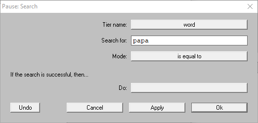
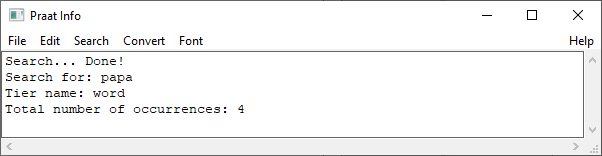

Step 2: Searching TextGrids
---------------------------

After indexing your TextGrid files (see :doc:`01-create_index`), you can search for
``intervals`` or ``points`` that match a specific text. This step is necessary 
to perform the activities described in :doc:`03-tasks`.

In this tutorial, we will search for all occurrences of the word **papa** in the TextGrids
of all files
Go to the ``Finder > Search`` command, a window like in :numref:`search-window`
will appear. The ``Tier name`` field lists all indexed tiers, 

.. _search-window:

   The ``Search`` window

.. _search-results:

   Results in the ``Praat Info`` after running the ``Search`` command
