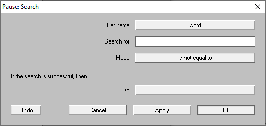
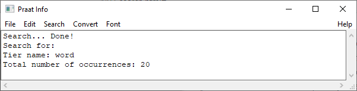
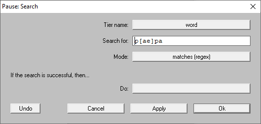
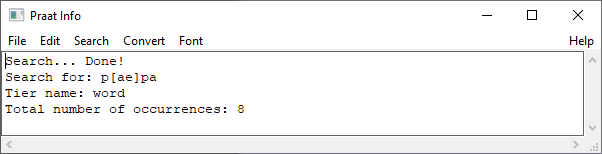

Step 2: Searching by text
-------------------------

After indexing your TextGrid files (see :doc:`01-create_index`), you can search for
``intervals`` or ``points`` that match a specific text. This step is necessary 
to perform the activities described in :doc:`03-tasks`.

Search the word *papa*
~~~~~~~~~~~~~~~~~~~~~~
We will start by searching all occurrences of the word *papa*
in the TextGrids of the folder ``tutorial/vowels`` (**example files**).

To start, index all the TextGrids as indicated in the :ref:`TextGrids in subfolders` section. Once
this is done, go to the ``Finder > Search`` command and fill up the window with the same
options as in :numref:`search-window`.

.. _search-window:

.. figure:: img/search-window.png
   :align: center

   The ``Search`` window

The field ``Tier name`` indicates the search domain. In our example, the shearch will only
be done on the TextGrids with the tier ``word``. In the ``Search for`` field, we specify
the text that we want to match, *papa*. In ``Mode``, we select ``is equal to``.

When pressing on the ``Ok`` button, the plug-in will look into the indexed files for those items that
match the text in the selected tier. The matched items can be ``intervals`` or ``points``.
At the end, the message in :numref:`search-results` will be shown. There are 4 occurrences
of the word in our TextGrid files.

.. _search-results:

.. figure:: img/search-results.png
   :align: center

   Results in the ``Praat Info`` after running the ``Search`` command

Search all items
~~~~~~~~~~~~~~~~
Imagine you want to search for all the transcribed items in the tier ``word`` of the files
in the ``tutorial/vowels`` folder. The easy way is to search for all items
that are not empty. Go to the ``Finder > Search`` again. This time you do not need to create an index
since the TextGrid files are already indexed.
In the window, complete the fields as in :numref:`search-window2`, make sure to leave
the ``Search for`` empty and set the ``Mode`` as ``is not equal to``.

.. _search-window2:

   ``Search`` window

The results are shown in :numref:`search-results2`.

.. _search-results2:

   Results in the ``Praat Info`` after running the ``Search`` command

Regular Expressions
~~~~~~~~~~~~~~~~~~~
In the ``Search`` window, you can select the `matches (regex)` option in the ``Mode`` field.
This is an useful feature that matches text using regular expressions.

For example, we can match all the items that match `papa` and `pepa` in one search.
Go to the ``Search`` window and fill up as in :numref:`search-window3`.

.. _search-window3:

   The ``Search`` window

In the window, ``p[ae]pa`` is a regex expressions where the characters in the brackets means that the
second character in the word ``p pa`` could be a vowel ``a`` or ``e``. In :numref:`search-results3`
we can see the results.

.. _search-results3:

   Results in the ``Praat Info`` after running the ``Search`` command

For more information visit the `Regular Expressions Tutorial`_ in Praat.

.. _Regular Expressions Tutorial: https://www.fon.hum.uva.nl/praat/manual/Regular_expressions.html
