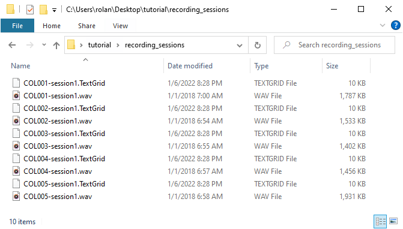
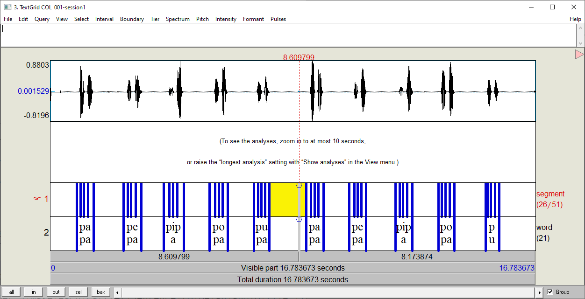
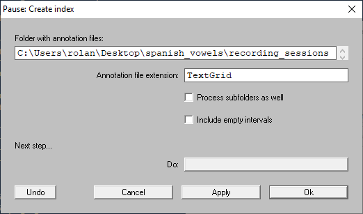
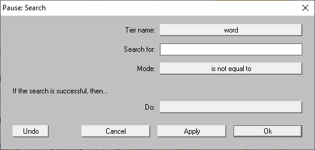
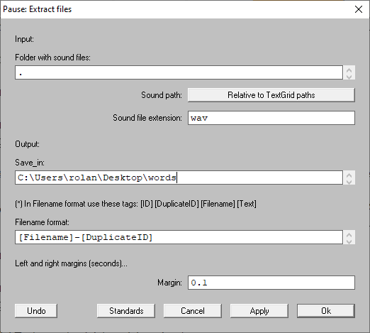
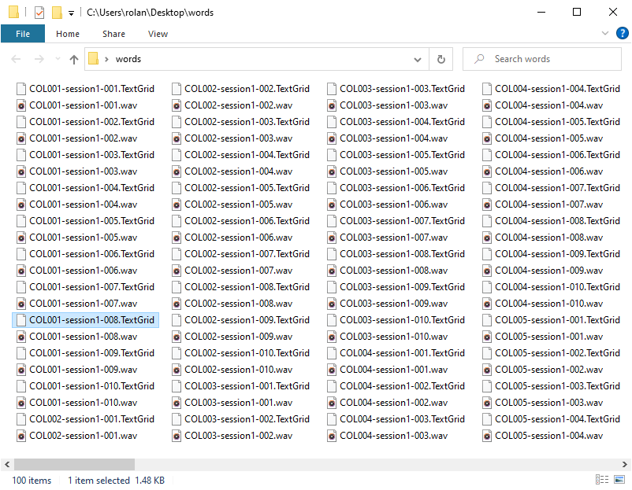
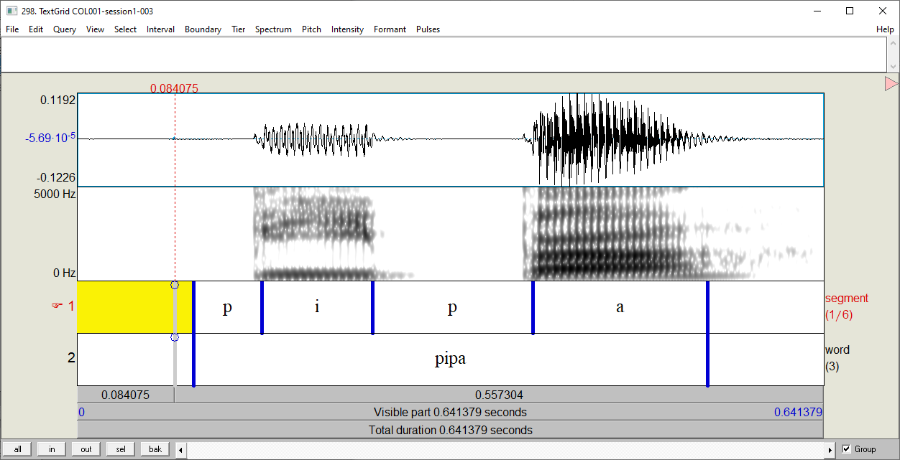
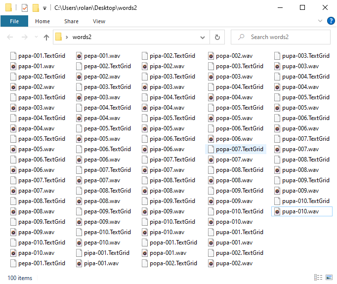
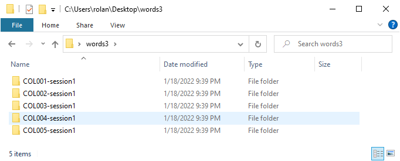
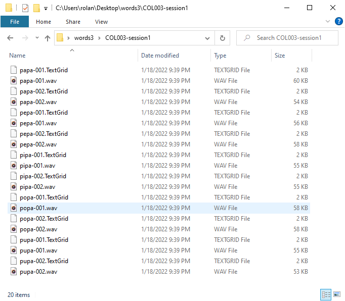

Extracting data
===============

Once you carry out a search, you can extract the sound and the
transcribed segments corresponding to the found items.
Each extracted item will be saved as a ``.TextGrid`` and
and ``.wav`` file.

Extractig words as files
------------------------

In this section, we will split a set of sound files along with their TextGrid using the ``Extract files...`` command.

For this example, we will use the ``recording_sessions`` folder of the **example files**. This folder contains the TextGrid and sound files in the :numref:`corpus-recording_sessions`. As you can see, both type of files come in pairs.

.. _corpus-recording_sessions:

   A screenshot of the folder **recording sessions**

For each file pair, the sound file contains a list of spanish words
pronounced twice by one unique speaker. The TextGrid provides the
transcription for the recording. As you can note in
:numref:`corpus-long_sound`, the TextGrid has one tier for words and
other for segments.

.. _corpus-long_sound:

   Sound file and its TextGrid in Praat for one speaker

Given all this description, let's extract and save as new files all the
transcribed items in the tier ``word`` in the files of the
``recording_sessions``  folder.

**Step 1:** Index the TextGrid files in the ``recording sessions``
folder (see :doc:`01-create_index` for more information).

.. _extract_data-index:

   Indexing the TextGrid files in the `recording_sessions` folder.

**Step 2:** Find all the transcribed items in the tier ``word``.
To do it, open the search window and copy the options in
:numref:`extract_data-search_all` (See :doc:`02-search` for more
information).

.. _extract_data-search_all:

   Indexing all TextGrid files in the `recording_sessions` folder.

**Step 3:** In the plug-in menu, go to ``Finder > Tasks`` and click on
``Extract files...`` A window similar to
:numref:`extract_data-extract_window` will pop up.

.. _extract_data-extract_window:

   ``Extract files`` window.

As you can notice, there are many options! Don't worry. At this moment,
only focus on the ``Save in`` field. Complete this field with the
directory where the extracted files will be stored in you machine.
In my case, I filled it up with the path
``C:\Users\rolan\Desktop\words``. Finally, press on ``Ok``.

Take a look to the ``Save in`` directory. The results should look like in
:numref:`extract_data-destiny_folder`.

.. _extract_data-destiny_folder:

   The extracted files in the destiny directory.

In total, there are 100 files (50 ``.TextGrids`` and 50 ``.wav`` files). Each
file pair contains only a word item as in :numref:`extract_data-extracted_item`
.

.. _extract_data-extracted_item:

   An example of a extracted item

Setting filenames
~~~~~~~~~~~~~~~~~

You can name the extracted files in different ways using the ``Extract 
files`` command. In the command window, go to the the field ``Filename 
format`` (See :numref:`extract_data-extract_window`). This field is filled up 
by default as ``[Filename]-[DuplicateID]``. The words in brackets are 
special, they are tags. The tag ``[Filename]`` indicates that each resulting 
file will take the name of the file where it was extracted. On the other 
hand, ``[DuplicateID]`` is a tag that assures that the files with the same 
name do not overwrite. This is carry out by adding an occurrence number to 
the new files at the moment they are created. The default number is ``001`` 
and it is assigned to the first occurrence of a file when it is saved in the 
destiny directory. If the name already exists, the command will increase the 
occurrence number to ``002`` and so on until the filename is not repeated in 
the destiny directory. Finally, note that the tags are separated by a ``-`` 
character. In the ``Extract files`` command, anything that is not a tag will 
be copy as it is to the resulting filename. 

Now that you know how the setting ``[filename]-[DuplicateID]`` works, take a look back to the :numref:`extract_data-destiny_folder` and make sense of the filenames. Here is a little explanation.

.. csv-table:: Naming files as ``[Filename]-[DuplicateID]``
   :header: "[Filename]", "String", "[DuplicateID]", "Output"
   :widths: 15, 5, 10, 20

   COL002-session1, \-, 001,COL002-session1-001.wav
   COL002-session1, \-, 002,COL002-session1-002.wav
   COL002-session1, \-, 003,COL002-session1-003.wav
   COL002-session1, \-, 004,COL002-session1-004.wav
   COL002-session1, \-, 005,COL002-session1-005.wav

You can use the text in the matched items as filenames. Go to the ``Format field`` and write ``[Text]-[DuplicateID]``. In the :numref:`extract_data-destiny_folder2`, there is a screenshot of the results.

.. _extract_data-destiny_folder2:

   The extracted files in the destiny directory.

Now, we can know which files contain which words. The only issue that arises is that we cannot distinguish which file correspond to which speaker. There are a couple of ways to solve this issue. My favourite one is to reorganize the extracted files into subfolders. Given the fact that there is one source file per speaker, we can hack the ``File format`` field and fill it up with ``[Filename]/[Text]-[DuplicateID]``. Here, the slash ``/`` separates the filename in two parts. The right part contains the name of the filenames and the left corresponds to the subfolders where the files will be stored. When you run the command, you will get a result as in :numref:`extract_data-destiny_folder3` where each subfolder contains a set of files as in :numref:`extract_data-destiny_folder4`.

.. _extract_data-destiny_folder3:

   The extracted files in the destiny directory.

.. _extract_data-destiny_folder4:

   The extracted files in the destiny directory.