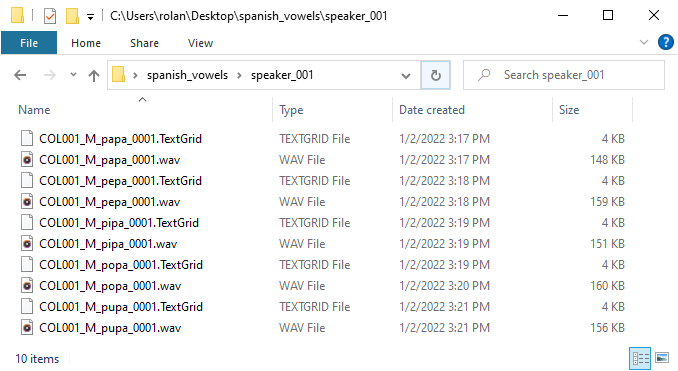
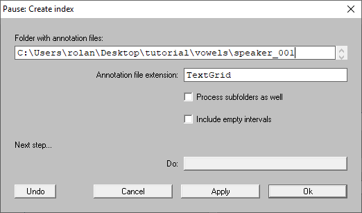
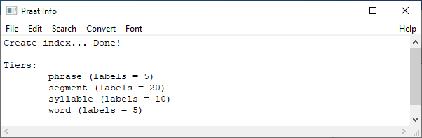
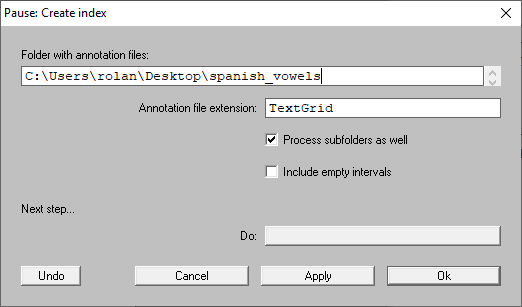
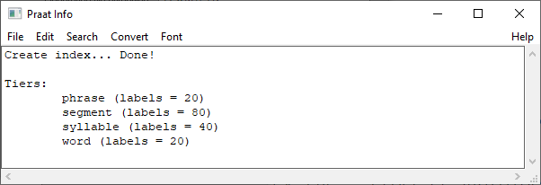

Tutorial
********

Finder is a Praat plug-in designed to work with TextGrid files.
By using this plug-in, you can explore the content of your TextGrid files, create transcription
reports, do audio extraction, edit your transcriptions and other stuffs.

In this tutorial, I will guide you through the basics of this tool and bring some ideas about
how to use the Finder in a linguistic project.

Requeriments
============
To follow this tutorial you will need:

* The latest release of Praat. You can download it from the `Praat website`_.
* The Finder plug-in. You can download it from GitHub in the following `link`_
  (see the `Download and installation`_ section).
* Download the `corpus for spanish vowels`_ (optional)

.. _Praat website: https://www.fon.hum.uva.nl/praat/
.. _`corpus for spanish vowels`: https://drive.google.com/open?id=1EwbBA1wTORFppY_-VQaw7QAB-SMJuIY6

.. _Download and installation:

Download and installation
=========================

You can get the latest release of the plug-in in the following `link`_. By clicking on it,
you will be redirected to a GitHub website as shown in :numref:`github-download`.

In the website, go to the **Assets** section and click on any of the two links: ``Source code (zip)`` or
``Source code (tar.gz)``. By doing this, a compressed folder will be downloaded.

.. _github-download:

.. figure:: img/github-download.png
   :align: center

   Download section on GitHub

Once the download is finished, uncompress the folder. Then, copy the uncompressed folder to the Praat
**preferences folder**. This is a directory created when you run Praat on your machine for the first
time. According to the Praat
manual, the **preferences folder** can be found in one of following directories depending on your
operating system:

* On Windows, ``C:\Users\your user name\Praat\``
* On Mac, ``/Users/your user name/Library/Preferences/Praat Prefs/``
* On Linux, ``/home/your user name/.praat-dir/``

In the :numref:`win-praat_preferences` there is a screenshot of the **preferences folder** in a computer with Windows 10. As you can see, the plug-in folder is also copied to this directory. In the :numref:`plugin_folder` there is a view of the plug-in folder.

.. _win-praat_preferences:

.. figure:: img/win-praat_preferences.png
   :align: center

   The **Praat Preferences** directory on Windows 10

.. _plugin_folder:

.. figure:: img/plugin_folder.png
   :align: center
   
   The plug-in folder

.. warning:: When uncompressing the downloaded folder, some tools put the plug-in folder within another folder.
   If this is your case, copy only the subfolder to the `preferences folder`. You can check it by looking at the
   `setup.praat` file. The plug-in folder contains this file just under it.

.. warning:: If you rename the plug-in's folder, do not remove the preffix `plugin`. This word is
   necessary for Praat to recognize the plug-in.

Finally, check that Praat can recognize the plug-in. Start Praat and go to ``Praat > Goodies`` in the menu bar. There, you should
be able to see the ``Finder`` submenu as in the :numref:`plugin_menu`.

.. _plugin_menu:

.. figure:: img/finder_menu.png
   :align: center
   
   The plug-in menu

.. _link: https://github.com/rolandomunoz/plugin_finder/releases/latest

Getting started
===============

Finder is a multipurpose tool. In this section we will review the following tasks:

* Create and index.
* Search into TextGrid files for interval or point items that match a specific text.
* Create reports of their annotation files. Create a table containing the number of occurrences
  of the transcribed items (e.g., words), or a table containing the time where certain items occurred.
* Select and visualize some specific items in your transcriptions.
* Extract intervals or point items along with their audio files and save them as new files.
* Make use of the script template function to script more specific tasks (advanced users)

Step 1: Creating an index
-------------------------

Creating an index is the first step to do before any task. This consists in telling
the plug-in where the annotation files are. By doing so, Praat will look for all
TextGrid files under a certain directory and will index their content internally.
This way, the plug-in will know the tier position, the type (inverval
or point), also its content.

First, let's start by indexing the files within the folder *speaker_001* of the **corpus for
spanish vowels**. In :numref:`speaker_001-folder` there is a screenshot of that folder.

.. _speaker_001-folder:

   A folder containing the audio and TextGrid files to be indexed.

To index the said folder, go to the ``Finder > Create index...`` command and click on it.
A window as in :numref:`index_window` will pop-up. In ``Folder with annotation files``
provide the directory of the folder in your machine. Leave the other options as in
:numref:`index_window` and press on ``Ok``

.. _index_window:

   The ``Create index...`` window

When the index is done, a message will appear in the ``Praat Info`` as in
:numref:`index-result_window`. The message show a summary of all tiers in
the TextGrid files. For example, the tier ``segment`` contains 20 labels.

.. _index-result_window:

   The ``Praat Info`` window showing the indexing results

Indexing TextGrids store in subfolders under the same directory
~~~~~~~~~~~~~~~~~~~~~~~~~~~~~~~~~~~~~~~~~~~~~~~~~~~~~~~~~~~~~~~
It is common that TextGrid files are stored in various subfolders within a common directory.
To index those files, check the ``Process subfolders as well`` of the ``Create index`` window
(see :numref:`index_window`).

Let's index all TextGrids in the **Corpus for Spanish Vowels**. First, let's identify the
directory that contains those files. In my computer, the directory is
``C:\Users\rolan\Desktop\spanish_vowels`` as you can see in the
:numref:`corpus_for_spanish_vowel-folder`.

.. _corpus_for_spanish_vowel-folder:

.. figure:: img/corpus_for_spanish_vowels-folder.png
   :align: center

   The directory containing all TextGrid files in the **Corpus for Spanish Vowels**

Once you have the directory path, copy it and go to the ``Finder > Create index...`` command.
Fill up the window with the path and check the ``Process subfolders as well``
option. Your window should looks similar to :numref:`index_window2`.

.. _index_window2:

   The ``Create index...`` window

After pressing on ``Ok``, you should have the message in :numref:`index-result_window2`

.. _index-result_window2:

   The ``Praat Info`` window showing the indexing results

Querying annotation files
-------------------------

Tasks
-----
