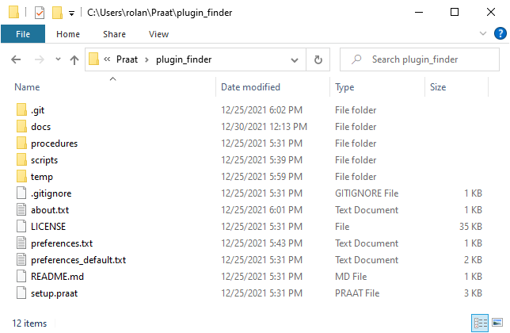
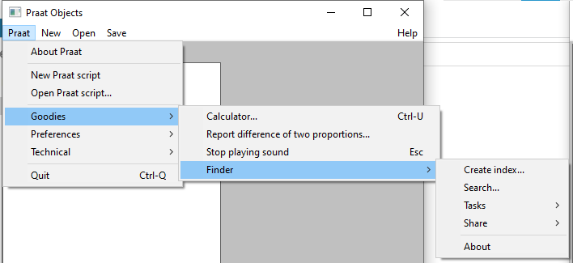

Installation
------------

You can get the latest release of the plug-in in the following `link`_. By clicking on it,
you will be redirected to a GitHub website as shown in :numref:`github-download`.

In the website, go to the **Assets** section and click on any of the two links: ``Source code (zip)`` or
``Source code (tar.gz)``. By doing this, a compressed folder will be downloaded.

.. _github-download:

.. figure:: img/github-download.png
   :align: center

   Download section on GitHub

Once the download is finished, uncompress the folder. Then, copy the uncompressed folder to the Praat
**preferences folder**. This is a directory created when you run Praat on your machine for the first
time. According to the Praat
manual, the **preferences folder** can be found in one of following directories depending on your
operating system:

* On Windows, ``C:\Users\your user name\Praat\``
* On Mac, ``/Users/your user name/Library/Preferences/Praat Prefs/``
* On Linux, ``/home/your user name/.praat-dir/``

In the :numref:`win-praat_preferences` there is a screenshot of the **preferences folder** in a computer with Windows 10. As you can see, the plug-in folder is also copied to this directory. In the :numref:`plugin_folder` there is a view of the plug-in folder.

.. _win-praat_preferences:

.. figure:: img/win-praat_preferences.png
   :align: center

   The **Praat Preferences** directory on Windows 10

.. _plugin_folder:

   
   The plug-in folder

.. warning:: When uncompressing the downloaded folder, some tools put the plug-in folder within another folder.
   If this is your case, copy only the subfolder to the `preferences folder`. You can check it by looking at the
   `setup.praat` file. The plug-in folder contains this file just under it.

.. warning:: If you rename the plug-in's folder, do not remove the preffix `plugin`. This word is
   necessary for Praat to recognize the plug-in.

Finally, check that Praat can recognize the plug-in. Start Praat and go to ``Praat > Goodies`` in the menu bar. There, you should
be able to see the ``Finder`` submenu as in the :numref:`plugin_menu`.

.. _plugin_menu:

   
   The plug-in menu

.. _link: https://github.com/rolandomunoz/plugin_finder/releases/latest
