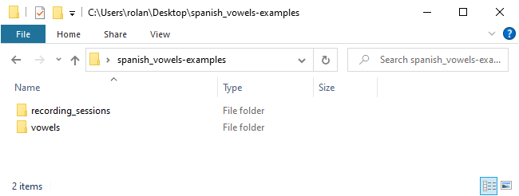

Requirements
------------

To follow this tutorial you will need:

**(a) Download Praat.** Get latest release of Praat. You can download it from the `Praat website`_.

**(b) Download the Finder plug-in.** Go to the `plug-in repository`_ in GitHub and download it (see the :doc:`installation` section).

**(c) The example files.** Download the `tutorial folder`_. This is a folder containing a set of
audio files and teir TextGrids. These files are designed to study the spanish vowels.
In the screenshot in the :numref:`tutorial_folder` you can see the subfolders,
``recording_sessions`` and ``vowels``.

.. _tutorial_folder:

   The tutorial folder

.. _Praat website: https://www.fon.hum.uva.nl/praat/
.. _tutorial folder: https://drive.google.com/file/d/1wffvyhLIzJImbdJWqNz13lWYrj7CO00l/view?usp=sharing
.. _link: https://github.com/rolandomunoz/plugin_finder/releases/latest
.. _plug-in repository: https://github.com/rolandomunoz/plugin_finder/releases/latest
